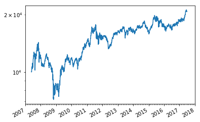
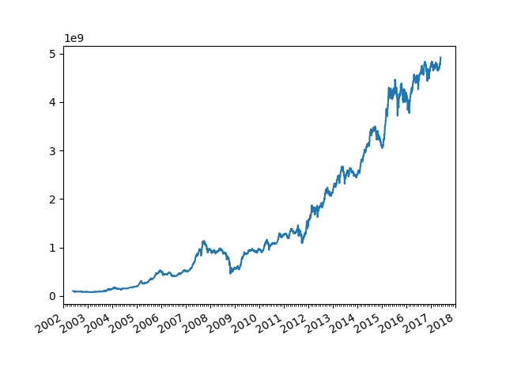
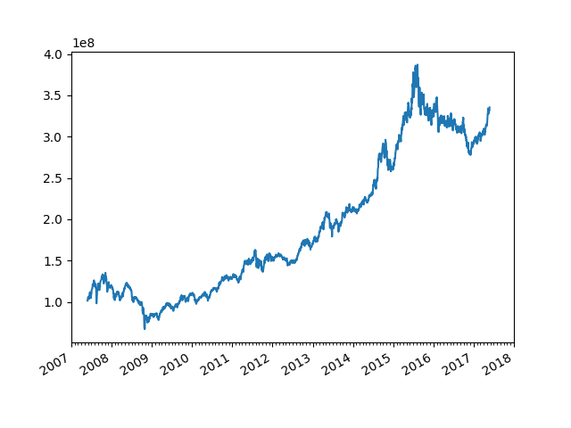

## 16.Dual momentum
### 종목 Universe
- WISE 스마트베타 Quality 지수
- WISE 스마트베타 Value 지수
- WISE 스마트베타 Momentum 지수
- WISE 스마트베타 LowVol 지수
### 매매전략
- 4개의 지수중 최근 6개월간 가장 많이 오른 지수에 투자
- 네 개의 지수의 6개월 수익이 모두 예금금리 이하로 감소하면 모든 종목 매도 후 현금 보유
- 월 1회 리밸런싱
- 비용 0

#### result

|Return|CAGR|표준편차|최고의해|최악의해|MDD|SR|
|------|----|-------|--------|-------|---|---|
|x9|12%|0.26|76%|-32%|53%|0.76|

----

## 28.original f-score
### 매매전략
- PBR 최저 20% 기업에만 투자 (상장폐지된 종목은 제외)
- F-Score 9개 요소를 검토해 맞으면 1점, 틀리면 0점을 매긴 후, 점수가 높은 20~30개 기업 매수
- 연 1회 리밸런싱
- 비용 0

#### result

|Return|CAGR|MDD|SR|
|------|----|---|---|
|x44|29%|59%|1.3|

----

## 34.대형주 '짬뽕' 전략
### 매매전략
- 시가총액 200위 기업
- 순이익, 자본, 영업현금흐름, EBITA, 배당>0 및 증자 없는 기업만 사용
- 퀄리티 순위 계산(GP/A)
- 벨류 콤보 순위 계산(PER+PBR+PCR+PSR+EV/EBITDA+배당수익률)
- 모멘텀 순위 계산(12개월 과거 수익률 순위)
- 순위 비중: 벨류 콤보 33%, 퀄리티 콤보 33%, 모멘텀 33%
- 통합 순위가 가장 높은 주식 매수
- 연 1회 리밸런싱
- 비용 0

#### result

|Return|CAGR|MDD|SR|
|------|----|---|---|
|x9|18%|54%|1.0|

